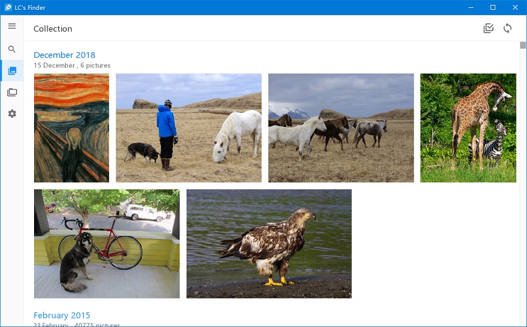
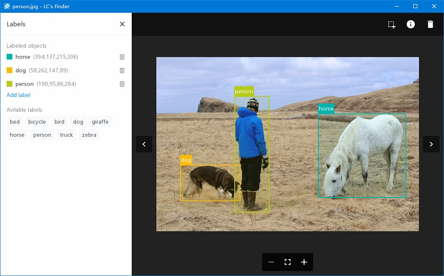
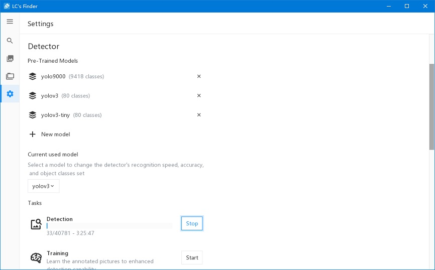
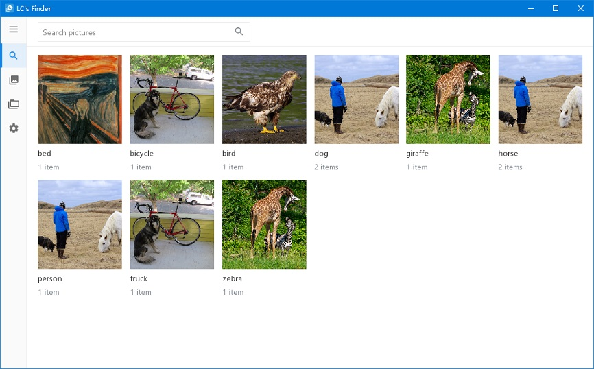

  
  <h3 align="center">LC's Finder</h3>
  

    图像标注与目标检测工具
  

  

    
    
    
    
    
    
    
  

## 介绍

LCFinder (LC's Finder) 是一个支持图像标注与目标检测的图片管理工具，主要使用 C 语言编写，由 [LCUI](https://lcui.lc-soft.io) 提供图形界面支持。和作者的其它项目一样，命名方式很简单，以 LC 开头，后面的 Finder 参考自 Mac OS 中的 Finder。

LCFinder 的界面及功能设计参考了 Windows 系统自带的“照片”应用，虽说是参考，但功能方面主要是按作者的个人需求而开发的，而且作者并不打算浪费时间去实现“照片”应用全部功能

### 功能特性

- **图像标注：** 提供简单的图像标注界面，可用于为 Yolo v3 和 v2 模型的训练任务制作数据集
- **目标检测：** 内置图像检测器，在开始检测任务后会自动标注图像中已检测到的对象，如果你觉得识别速度慢、内存占用大或想更改对象种类范围，可以试试改用其它预训练模型
- **标签搜索：** 在标签视图里可以浏览已标记的图片，支持手动为图片添加标签
- **多语言支持：** 自带简体中文、繁体中文、英文翻译文件，可扩展支持其它语言
- **私人空间：** 带有密码保护的空间，将非公开的图片源放到此空间内可以隐藏它们
- **UWP：** 支持 Windows 通用应用平台（UWP），你可以[点击此链接](https://www.microsoft.com/store/apps/9NBLGGH401X5)到微软应用商店中查看它。注意，受限于 UWP 版本的开发成本，并不会与桌面版同步更新。

### 缺少的功能

- **Linux 支持：** 当前版本并不一定能在 Linux 系统中编译通过并正常工作，请等待其他熟悉 Linux 的开发者来贡献代码，作者暂时不想折腾
- **训练模型：** 网络上的一些预训练模型都比较通用，有些人会有训练专用模型的需求，要是有图形化的界面来管理模型训练任务的话会方便很多，省去查资料、改源码和重新编译的麻烦，毕竟网络上有些文章还在介绍如何通过改源码、配置、重新编译等操作来训练模型。如果你熟悉 darknet，可以帮助我们完善 [darknetlib](https://github.com/lc-soft/darknetlib)

## 截图

## 安装

如果你想使用检测器检测一些图像，那么需要如下步骤:

1. 下载预训练模型文件:
   - `yolov3.cfg` (236 MB COCO Yolo v3) - requires 4 GB GPU-RAM: https://pjreddie.com/media/files/yolov3.weights
    - `yolov3-tiny.cfg` (34 MB COCO Yolo v3 tiny) - requires 1 GB GPU-RAM: https://pjreddie.com/media/files/yolov3-tiny.weights
    - `yolo9000.cfg` (186 MB Yolo9000-model) - requires 4 GB GPU-RAM: http://pjreddie.com/media/files/yolo9000.weights
1. 复制 `.weights` 文件到 `app/detector/models` 中与它同名的目录里，例如：复制 `yolov3.weights` 文件到 `app/detector/models/yolov3/`

## 贡献

在上面的[介绍](#介绍)中有提到缺少的功能，如果你有兴趣帮助解决问题并直接贡献到代码库，请先阅读[贡献指南](CONTRIBUTING.md)，其中包括以下内容：

- [如何构建并运行](CONTRIBUTING.md#构建和运行)
- [目录结构](CONTRIBUTING.md#目录结构)
- [提交合并请求](CONTRIBUTING.md#拉取请求)
- [贡献翻译](CONTRIBUTING.md#翻译)

## 相关项目

LCFinder 的基础功能都离不开这些项目的支持：

- [LCUI](https://lcui.lc-soft.io) — 图形界面引擎，提供图形界面支持
- [LCUI.css](https://github.com/lc-ui/lcui.css) — UI 的组件库，为图形界面提供基础的样式和组件
- [darknetlib](https://github.com/lc-soft/darknetlib) — darknet 的 C API 库，提供图像识别功能

## 许可证

遵循 [GPL 许可证](https://opensource.org/licenses/GPL-2.0)发布，仅供技术交流和学习之用。
